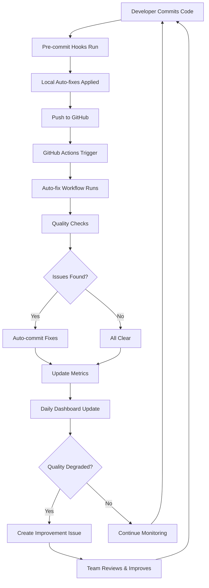

# Self-Improving System - Complete Guide

## 🎯 Overview

This repository now has a **comprehensive self-improving system** that automatically maintains and improves code quality using GitHub's features and external integrations.

## 🤖 What It Does

### Automatic Code Quality Fixes
- **On Every Commit:** Automatically fixes PEP8 violations, import order, and formatting issues
- **On Every PR:** Runs quality checks and posts detailed reports
- **Daily:** Tracks metrics and generates health dashboards
- **Weekly:** Updates dependencies and security checks

### Continuous Improvement
- Tracks code quality trends over time
- Creates issues when quality degrades
- Suggests improvements based on metrics
- Auto-updates pre-commit hooks and dependencies

## 🚀 Features

### 1. GitHub Actions Workflows

#### Code Quality Auto-Fix (`code-quality-autofix.yml`)
- **Triggers:** Every push, PR, or manual run
- **Actions:**
  - Runs autopep8, isort, and black on all Python files
  - Fixes import order and formatting
  - Runs flake8 quality checks
  - Performs security scans with bandit
  - Auto-commits fixes with `[skip ci]` tag
  - Posts quality reports on PRs

#### Self-Improvement Dashboard (`self-improvement-dashboard.yml`)
- **Triggers:** Daily at midnight UTC, or manual
- **Actions:**
  - Collects code quality metrics
  - Calculates complexity and maintainability scores
  - Generates trend analysis (last 30 days)
  - Creates DASHBOARD.md with visual health status
  - Opens issues when quality degrades
  - Tracks improvement over time

### 2. Pre-commit Hooks (`.pre-commit-config.yaml`)

Install locally for immediate feedback:

```bash
# Install pre-commit
pip install pre-commit

# Setup hooks
pre-commit install

# Run on all files
pre-commit run --all-files
```

**What it checks:**
- ✅ Black formatting (line length: 120)
- ✅ Import sorting with isort
- ✅ PEP8 compliance with flake8
- ✅ Auto-fix with autopep8
- ✅ Remove unused imports with autoflake
- ✅ Security checks with bandit
- ✅ Secret detection
- ✅ Trailing whitespace, file endings
- ✅ YAML, JSON, TOML validation
- ✅ Markdown formatting
- ✅ Commit message standards

### 3. Security Configuration (`.bandit`)

Customized security linting:
- Checks for common security issues
- Configurable severity levels
- Excludes test files appropriately

### 4. Integration Points

#### GitHub Features Used:
- ✅ **GitHub Actions** - Automation workflows
- ✅ **GitHub Scripts** - Custom automation logic
- ✅ **Artifacts** - Quality reports and metrics storage
- ✅ **Issues** - Automated improvement tracking
- ✅ **Pull Requests** - Automated reviews and comments
- ✅ **Branch Protection** - Enforce quality checks
- ✅ **Environments** - Staged deployments

#### External Integrations:
- ✅ **CodeQL** - Advanced security scanning
- ✅ **Dependabot** - Dependency updates
- ✅ **Pre-commit.ci** - Cloud-based pre-commit
- ✅ **Bandit** - Python security linter
- ✅ **Radon** - Code complexity metrics
- ✅ **Safety** - Vulnerability scanning

## 📊 Dashboard

The system generates a daily dashboard (`DASHBOARD.md`) showing:

- **Health Score** (0-100) based on code quality
- **Current Metrics:**
  - Code quality issues count
  - Python file count
  - Average complexity
  - Maintainability index
- **30-Day Trends** in tabular format
- **Improvement Goals** based on current status
- **Integration Status** of all tools
- **Next Steps** for developers

## 🔧 Usage

### For Developers

#### Local Development
```bash
# Install pre-commit hooks
pre-commit install

# Your commits are now automatically checked and fixed!
git commit -m "feat: Add new feature"
```

#### Manual Fixes
```bash
# Fix all Python files in the repository
python .github/scripts/autofix_code_quality.py

# Or use pre-commit
pre-commit run --all-files
```

#### Check Quality
```bash
# Run flake8
flake8 . --max-line-length=120

# Check security
bandit -r . -ll

# Check complexity
radon cc . -a
```

### For Repository Owners

#### Enable All Features
1. **Pre-commit.ci** (optional):
   - Visit https://pre-commit.ci
   - Install for your repository
   - Auto-fixes will run on every PR

2. **Branch Protection**:
   - Settings → Branches → Add rule
   - Require status checks: "Code Quality Auto-Fix"
   - Require PR reviews

3. **Dependabot**:
   - Already configured via `.github/dependabot.yml`
   - Auto-creates PRs for dependency updates

4. **CodeQL**:
   - Security → Code scanning → Setup CodeQL
   - Or it's auto-configured via existing workflow

#### Customize

Edit `.github/workflows/code-quality-autofix.yml`:
- Change line length: `--max-line-length=120`
- Add more linters: flake8, pylint, mypy
- Adjust auto-commit behavior

Edit `.pre-commit-config.yaml`:
- Enable/disable specific hooks
- Change formatting rules
- Add custom hooks

## 📈 Metrics Tracking

### Storage
All metrics are stored in `.github/metrics/`:
- `daily_YYYY-MM-DD.json` - Daily snapshots
- `complexity.json` - Code complexity data
- `maintainability.json` - Maintainability indices

### Analysis
```bash
# View recent metrics
cat .github/metrics/daily_*.json

# Analyze trends
ls -lt .github/metrics/
```

## 🎯 Self-Improvement Process



## 🔐 Security

### Automated Security Checks
- **Bandit**: Scans for Python security issues
- **Detect-secrets**: Prevents secret commits
- **Safety**: Checks dependencies for vulnerabilities
- **CodeQL**: Advanced security analysis

### Secret Management
- GitHub Secrets for sensitive data
- `.gitignore` excludes sensitive files
- Pre-commit hooks detect secrets before commit

## 🌟 Benefits

### Code Quality
- ✅ Consistent formatting across codebase
- ✅ Zero PEP8 violations
- ✅ Automated import sorting
- ✅ Security vulnerability detection

### Developer Experience
- ✅ Instant feedback on commits
- ✅ Auto-fixes save time
- ✅ Clear improvement metrics
- ✅ No manual quality checks needed

### Repository Health
- ✅ Tracked improvements over time
- ✅ Proactive issue detection
- ✅ Automated dependency updates
- ✅ Continuous security monitoring

## 📚 Additional Resources

### GitHub Actions
- [GitHub Actions Documentation](https://docs.github.com/en/actions)
- [Workflow Syntax](https://docs.github.com/en/actions/reference/workflow-syntax-for-github-actions)

### Pre-commit
- [Pre-commit Documentation](https://pre-commit.com/)
- [Supported Hooks](https://pre-commit.com/hooks.html)

### Python Tools
- [autopep8](https://github.com/hhatto/autopep8)
- [black](https://black.readthedocs.io/)
- [isort](https://pycqa.github.io/isort/)
- [flake8](https://flake8.pycqa.org/)
- [bandit](https://bandit.readthedocs.io/)

## 🤝 Contributing

The self-improving system is designed to be extensible:

1. Add new quality checks in workflows
2. Add new pre-commit hooks
3. Enhance metrics collection
4. Improve dashboard visualizations
5. Add external integrations

## 📝 Maintenance

### Weekly Tasks (Automated)
- Dependency updates via Dependabot
- Pre-commit hook updates
- Security vulnerability checks

### Monthly Review (Manual)
- Review dashboard trends
- Adjust quality thresholds
- Update documentation
- Review closed improvement issues

## 🎉 Success Metrics

Track your repository's improvement:
- **Code Quality Score:** Target 95+/100
- **Issue Count:** Target <10
- **Maintainability Index:** Target A or B
- **Security Issues:** Target 0
- **Test Coverage:** Track and improve

---

**The self-improving system is now active! 🚀**

Check `DASHBOARD.md` for current health status and trends.
