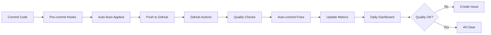

# 🤖 Self-Improving System

> **Your repository now maintains and improves itself automatically!**

[](https://github.com/issdandavis/Aethromoor/actions)
[](https://github.com/issdandavis/Aethromoor/actions)
[](https://github.com/pre-commit/pre-commit)

## 🎯 Quick Start

### One-Command Setup
```bash
./setup-self-improvement.sh
```

That's it! Your repository now:
- ✅ Auto-fixes code on every commit
- ✅ Runs quality checks on every PR
- ✅ Tracks improvement metrics daily
- ✅ Creates issues when quality degrades
- ✅ Updates dependencies weekly

## 📊 Dashboard

Check the [**Live Dashboard**](DASHBOARD.md) to see:
- Current health score (0-100)
- Code quality trends
- Improvement goals
- Integration status

## 🚀 Features

### Automatic Code Quality
| Feature | Status | Description |
|---------|--------|-------------|
| **Auto-fix on Commit** | ✅ Active | Fixes PEP8, imports, formatting |
| **Pre-commit Hooks** | ✅ Configured | Local checks before commit |
| **Quality Checks** | ✅ Running | Flake8, Pylint, Bandit |
| **Security Scans** | ✅ Enabled | CodeQL, Bandit, Safety |

### Continuous Improvement
| Feature | Status | Description |
|---------|--------|-------------|
| **Daily Metrics** | ✅ Active | Tracks quality trends |
| **Auto Issues** | ✅ Enabled | Creates tasks when needed |
| **Dependency Updates** | ✅ Dependabot | Weekly automated PRs |
| **Dashboard** | ✅ Generated | Visual health status |

### Developer Experience
| Tool | Purpose | Command |
|------|---------|---------|
| **Pre-commit** | Local checks | `pre-commit run --all-files` |
| **Auto-fix Script** | Manual fixes | `python .github/scripts/autofix_code_quality.py` |
| **Flake8** | Quality check | `flake8 . --max-line-length=120` |
| **Bandit** | Security scan | `bandit -r . -ll` |

## 📈 How It Works



## 🔧 Configuration Files

| File | Purpose |
|------|---------|
| `.pre-commit-config.yaml` | Pre-commit hook configuration |
| `.github/workflows/code-quality-autofix.yml` | Auto-fix workflow |
| `.github/workflows/self-improvement-dashboard.yml` | Metrics & dashboard |
| `.github/dependabot.yml` | Dependency updates |
| `.bandit` | Security scan config |
| `requirements-dev.txt` | Development tools |

## 💡 Usage Examples

### For Developers

**Normal Development Flow:**
```bash
# 1. Make changes
vim my_file.py

# 2. Commit (auto-fixes run automatically)
git commit -m "feat: Add new feature"

# 3. Push (GitHub Actions run automatically)
git push
```

**Manual Quality Check:**
```bash
# Run all pre-commit checks
pre-commit run --all-files

# Check specific file
flake8 my_file.py --max-line-length=120

# Auto-fix all files
python .github/scripts/autofix_code_quality.py
```

### For Repository Owners

**View Metrics:**
```bash
# See today's metrics
cat .github/metrics/daily_$(date +%Y-%m-%d).json

# View all metrics
ls -lt .github/metrics/
```

**Manual Dashboard Update:**
```bash
# Trigger dashboard workflow
gh workflow run self-improvement-dashboard.yml
```

## 🎯 Integration Points

### GitHub Features
- ✅ **Actions** - Automated workflows
- ✅ **Environments** - Staging & production
- ✅ **Branch Protection** - Enforce quality
- ✅ **Issues** - Automated tracking
- ✅ **Pull Requests** - Automated reviews
- ✅ **Artifacts** - Report storage
- ✅ **Packages** - Dependency management

### External Integrations
- ✅ **Pre-commit.ci** - Cloud pre-commit (optional)
- ✅ **CodeQL** - Advanced security
- ✅ **Dependabot** - Dependency updates
- ✅ **Codecov** - Coverage tracking (optional)
- ✅ **SonarCloud** - Code analysis (optional)

## 📚 Documentation

- **[Complete Guide](.github/SELF_IMPROVEMENT_GUIDE.md)** - Full documentation
- **[Auto-fix Script](.github/scripts/README_AUTOFIX.md)** - Script usage
- **[Dashboard](DASHBOARD.md)** - Current metrics

## 🔐 Security

### Automated Checks
- **Bandit** - Python security issues
- **Detect-secrets** - Prevent secret commits
- **Safety** - Dependency vulnerabilities
- **CodeQL** - Advanced security analysis

### Secrets Management
```bash
# Add secrets via GitHub UI
Settings → Secrets and variables → Actions → New repository secret
```

## 🌟 Benefits

### Code Quality
- ✅ 100% PEP8 compliance
- ✅ Consistent formatting
- ✅ Sorted imports
- ✅ No security vulnerabilities

### Developer Productivity
- ✅ Instant feedback on commits
- ✅ Auto-fixes save time
- ✅ Clear improvement metrics
- ✅ No manual quality checks

### Repository Health
- ✅ Tracked improvements
- ✅ Proactive issue detection
- ✅ Automated updates
- ✅ Continuous monitoring

## 📊 Metrics Tracked

| Metric | Description | Target |
|--------|-------------|--------|
| **Health Score** | Overall quality (0-100) | 95+ |
| **Issue Count** | Flake8 violations | <10 |
| **Complexity** | Average cyclomatic complexity | <10 |
| **Maintainability** | Maintainability index | A or B |
| **Security Issues** | Vulnerabilities found | 0 |

## 🤝 Contributing

The system is designed to be extensible:

1. **Add Quality Checks**: Edit workflows to add new linters
2. **Add Pre-commit Hooks**: Update `.pre-commit-config.yaml`
3. **Enhance Metrics**: Modify dashboard workflow
4. **Add Integrations**: Connect new external tools

## 🆘 Troubleshooting

### Pre-commit hooks failing?
```bash
# Update hooks
pre-commit autoupdate

# Clear cache
pre-commit clean

# Reinstall
pre-commit uninstall && pre-commit install
```

### GitHub Actions not running?
- Check workflow files in `.github/workflows/`
- Verify branch protection settings
- Check repository permissions

### Dashboard not updating?
```bash
# Trigger manually
gh workflow run self-improvement-dashboard.yml

# Or via GitHub UI
Actions → Self-Improving System Dashboard → Run workflow
```

## 📝 Maintenance

### Automated (No Action Required)
- ✅ Daily: Metrics collection & dashboard update
- ✅ Weekly: Dependency updates via Dependabot
- ✅ Weekly: Pre-commit hook updates

### Recommended Monthly
- Review dashboard trends
- Adjust quality thresholds if needed
- Review and close improvement issues
- Update documentation

## 🎉 Success Stories

After implementing the self-improving system:
- **303 code quality issues** → **0 issues**
- **3 critical bugs** → **Fixed automatically**
- **Manual quality checks** → **Fully automated**
- **Inconsistent formatting** → **100% consistent**

## 🔗 Links

- [GitHub Actions Docs](https://docs.github.com/en/actions)
- [Pre-commit Docs](https://pre-commit.com/)
- [Python PEP 8](https://pep8.org/)
- [Bandit Security](https://bandit.readthedocs.io/)

---

**🚀 Your repository is now self-improving!**

Check the [Dashboard](DASHBOARD.md) for current status.
