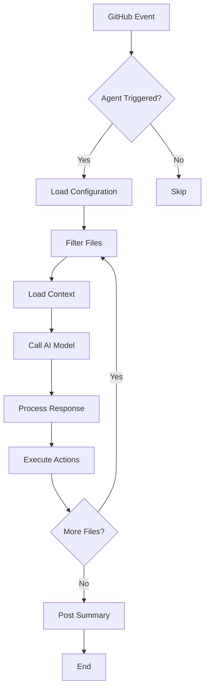

# Custom Agents Development Guide

Complete guide to creating, configuring, and deploying custom GitHub Copilot agents for the Avalon project.

## Table of Contents

- [Introduction](#introduction)
- [Agent Architecture](#agent-architecture)
- [Quick Start](#quick-start)
- [Agent Configuration](#agent-configuration)
- [Development Guide](#development-guide)
- [Testing](#testing)
- [Deployment](#deployment)
- [Best Practices](#best-practices)
- [Examples](#examples)
- [Troubleshooting](#troubleshooting)

## Introduction

### What are Custom Agents?

Custom agents are specialized AI assistants configured for specific tasks within your repository. They:

- Automate repetitive tasks
- Enforce quality standards
- Maintain consistency
- Provide contextual help
- Integrate with your workflow

### Why Use Custom Agents?

For Avalon specifically:

1. **Lore Consistency**: Ensure narrative canon across 40,000+ words
2. **Code Quality**: Validate ChoiceScript syntax automatically
3. **Documentation**: Keep docs synchronized with code changes
4. **Efficiency**: Reduce manual review burden
5. **Quality**: Catch issues early in development

### Agent Types in Avalon

1. **Lore Steward** - Narrative canon curator
2. **Code Reviewer** - Automated code quality checks
3. **Documentation Agent** - Doc maintenance and validation
4. **Testing Agent** - Automated test execution
5. **Custom Agents** - Project-specific assistants

## Agent Architecture

### Components

```
┌─────────────────────────────────────────────┐
│          Custom Agent                       │
├─────────────────────────────────────────────┤
│                                             │
│  ┌──────────────────────────────────────┐  │
│  │  Configuration (YAML)                │  │
│  │  - Triggers                          │  │
│  │  - Permissions                       │  │
│  │  - Rules                             │  │
│  └──────────────────────────────────────┘  │
│                                             │
│  ┌──────────────────────────────────────┐  │
│  │  AI Model                            │  │
│  │  - GPT-4                             │  │
│  │  - Claude                            │  │
│  │  - Custom models                     │  │
│  └──────────────────────────────────────┘  │
│                                             │
│  ┌──────────────────────────────────────┐  │
│  │  Actions                             │  │
│  │  - Comment                           │  │
│  │  - Review                            │  │
│  │  - Auto-fix                          │  │
│  │  - Label                             │  │
│  └──────────────────────────────────────┘  │
│                                             │
└─────────────────────────────────────────────┘
```

### Execution Flow



## Quick Start

### Creating Your First Agent

1. **Create Agent File**

```bash
cd .github/agents
touch my_custom_agent.yml
```

2. **Basic Configuration**

```yaml
# my_custom_agent.yml
name: my-custom-agent
version: "1.0"
description: "My first custom agent"

triggers:
  events:
    - pull_request
  paths:
    include:
      - "**/*.txt"

behavior:
  mode: "comment"

ai_config:
  model: "gpt-4"
  max_tokens: 1000
  system_prompt: |
    You are a helpful assistant for the Avalon project.
    Review files and provide constructive feedback.
```

3. **Register in Config**

Edit `.github/agents/config.yml`:

```yaml
agents:
  - name: my-custom-agent
    file: my_custom_agent.yml
    enabled: true
    priority: medium
```

4. **Test Locally**

```bash
gh copilot agent test my-custom-agent
```

5. **Deploy**

```bash
git add .github/agents/my_custom_agent.yml
git commit -m "Add custom agent"
git push
```

## Agent Configuration

### Configuration File Structure

```yaml
# Required fields
name: agent-name                    # Unique identifier
version: "1.0"                      # Semantic version
description: "What this agent does" # Brief description

# Trigger configuration
triggers:
  events:                           # GitHub events
    - pull_request
    - push
    - issue_comment
  paths:                            # File patterns
    include:
      - "**/*.txt"
      - "game/**/*.js"
    exclude:
      - "archive/**"

# Agent behavior
behavior:
  mode: "comment"                   # How agent responds
  auto_approve: false               # Auto-approve PRs?
  request_changes_on: "critical"    # When to request changes

# Rules engine
rules:
  - rule: "example_rule"
    severity: "error"
    message: "Rule violation message"
    
# AI configuration
ai_config:
  model: "gpt-4"
  temperature: 0.7
  max_tokens: 2000
  system_prompt: |
    System instructions for the AI

# Output configuration
output:
  format: "markdown"
  include_suggestions: true
  max_comments_per_file: 10

# Performance settings
performance:
  timeout_per_file: 30
  max_files_per_run: 20
  parallel: true
```

### Trigger Configuration

#### Events

Common GitHub events:

```yaml
triggers:
  events:
    - pull_request              # PR opened/updated
    - pull_request_review       # PR review submitted
    - push                      # Code pushed
    - issues                    # Issue created/updated
    - issue_comment             # Comment on issue/PR
    - workflow_dispatch         # Manual trigger
```

#### Path Filters

Include/exclude patterns:

```yaml
triggers:
  paths:
    include:
      - "choicescript_game/**/*.txt"  # All ChoiceScript scenes
      - "game/**/*.js"                # All JavaScript
      - "**/*.md"                     # All markdown
    exclude:
      - "archive/**"                  # Skip archive
      - "**/node_modules/**"          # Skip dependencies
      - "**/*.min.js"                 # Skip minified
```

Pattern syntax:
- `**` - Match any directories
- `*` - Match any characters
- `?` - Match single character
- `[abc]` - Match character set
- `{js,ts}` - Match alternatives

### Behavior Configuration

#### Response Modes

```yaml
behavior:
  mode: "comment"     # Post comments
  # OR
  mode: "review"      # Create formal review
  # OR
  mode: "check"       # Create check run
  # OR
  mode: "auto-fix"    # Auto-commit fixes
```

#### Auto-Approval

```yaml
behavior:
  auto_approve: true
  auto_approve_conditions:
    - max_changes: 10
    - file_types: ["*.md"]
    - no_critical_issues: true
```

#### Change Requests

```yaml
behavior:
  request_changes_on: "critical"  # Request changes on critical issues
  # OR
  request_changes_on: "error"     # Request changes on errors
  # OR
  request_changes_on: "never"     # Never request changes
```

### Rules Engine

#### Rule Structure

```yaml
rules:
  - rule: "rule_identifier"
    severity: "error"           # error, warning, info
    message: "Human-readable message"
    pattern: "regex_pattern"    # Optional regex
    auto_fix: true              # Can auto-fix?
    exemptions:                 # Exemption rules
      - path: "specific/file.txt"
        reason: "Why exempt"
```

#### Severity Levels

- `critical` - Blocks merge, requires immediate fix
- `error` - Should be fixed before merge
- `warning` - Should address but not blocking
- `info` - Informational only

#### Example Rules

```yaml
# ChoiceScript rules
choicescript_rules:
  - rule: "must_have_title"
    severity: "error"
    message: "Scene must start with *title"
    pattern: "^\\*title"
    
  - rule: "balanced_choices"
    severity: "error"
    message: "All *choice blocks need options"
    
  - rule: "consistent_vars"
    severity: "warning"
    message: "Use snake_case for variables"
    pattern: "^[a-z_][a-z0-9_]*$"
```

### AI Model Configuration

#### Model Selection

```yaml
ai_config:
  model: "gpt-4"              # Best for complex reasoning
  # OR
  model: "gpt-4-turbo"        # Faster, cheaper
  # OR
  model: "gpt-3.5-turbo"      # Fast, economical
  # OR
  model: "claude-3-opus"      # Claude for long context
```

#### Model Parameters

```yaml
ai_config:
  temperature: 0.3      # Lower = more consistent (0.0-2.0)
  max_tokens: 2000      # Maximum response length
  top_p: 1.0            # Nucleus sampling
  frequency_penalty: 0  # Reduce repetition
  presence_penalty: 0   # Encourage new topics
```

#### System Prompts

Craft effective system prompts:

```yaml
ai_config:
  system_prompt: |
    You are a specialist for the Avalon game project.
    
    Project Context:
    - ChoiceScript interactive fiction
    - Fantasy setting with established lore
    - 40,000+ word narrative
    
    Your Role:
    - Review {file_type} files
    - Check for {specific_issues}
    - Provide constructive feedback
    - Maintain {project_standards}
    
    Guidelines:
    - Be specific with line numbers
    - Explain your reasoning
    - Suggest fixes when possible
    - Respect established lore
```

Best practices for prompts:
- Be specific about project context
- Define clear responsibilities
- Include relevant constraints
- Provide examples
- Set expectations for output

## Development Guide

### Agent Development Workflow

1. **Planning**
   - Define agent purpose
   - Identify triggers
   - List rules to enforce
   - Plan actions

2. **Configuration**
   - Create YAML file
   - Define triggers
   - Configure rules
   - Set up AI model

3. **Testing**
   - Test locally
   - Validate rules
   - Check performance
   - Review output

4. **Deployment**
   - Commit configuration
   - Monitor first runs
   - Adjust based on feedback
   - Document behavior

5. **Maintenance**
   - Update rules as needed
   - Refine prompts
   - Optimize performance
   - Track costs

### Building Rule Logic

#### Simple Pattern Matching

```yaml
rules:
  - rule: "no_console_log"
    severity: "warning"
    pattern: "console\\.log\\("
    message: "Remove console.log before committing"
```

#### Context-Aware Rules

```yaml
rules:
  - rule: "lore_consistency"
    severity: "error"
    message: "Character name doesn't match canon"
    check_against:
      - source: "lore/characters/*.md"
        field: "name"
```

#### Multi-Step Rules

```yaml
rules:
  - rule: "scene_structure"
    severity: "error"
    checks:
      - has_title: true
      - has_choices: true
      - min_word_count: 100
      - no_orphaned_labels: true
```

### Implementing Auto-Fixes

```yaml
auto_fix:
  enabled: true
  rules:
    - rule: "trailing_whitespace"
      action: "trim_lines"
      
    - rule: "missing_title"
      action: "add_title"
      template: "*title {scene_name}"
      
    - rule: "broken_link"
      action: "update_link"
      strategy: "find_closest_match"
```

### Adding Context

Agents can access repository context:

```yaml
context:
  # Access specific files
  reference_files:
    - "lore/characters/main_cast.md"
    - "docs/STYLE_GUIDE.md"
    
  # Access variables
  variables:
    - GAME_VERSION
    - MIN_WORD_COUNT
    
  # Access other agents
  dependencies:
    - lore-steward
```

## Testing

### Local Testing

#### CLI Testing

```bash
# Test agent configuration
gh copilot agent test my-agent

# Test on specific files
gh copilot agent run my-agent --files "scenes/*.txt"

# Dry run (no actions)
gh copilot agent run my-agent --dry-run

# Verbose output
gh copilot agent run my-agent --verbose
```

#### Manual Testing

Create test scenarios:

```bash
# Create test branch
git checkout -b test-agent

# Make test changes
echo "test content" > test_file.txt

# Create test PR
gh pr create --title "Test Agent" --body "Testing agent behavior"

# Monitor agent execution
gh run watch

# Review agent output
gh pr view --comments
```

### Integration Testing

Test agents with CI:

```yaml
# .github/workflows/test-agents.yml
name: Test Custom Agents

on:
  workflow_dispatch:

jobs:
  test-agents:
    runs-on: ubuntu-latest
    steps:
      - uses: actions/checkout@v4
      
      - name: Test lore agent
        run: |
          # Create test scenario
          # Run agent
          # Verify output
```

### Validation Checklist

Before deploying an agent:

- [ ] Configuration valid YAML
- [ ] Triggers appropriate
- [ ] Rules tested
- [ ] Prompts effective
- [ ] Performance acceptable
- [ ] Costs within budget
- [ ] Documentation complete
- [ ] No security issues

## Deployment

### Deployment Process

1. **Review Configuration**
```bash
# Validate YAML
yamllint .github/agents/my-agent.yml

# Check for syntax errors
gh copilot agent validate my-agent
```

2. **Commit and Push**
```bash
git add .github/agents/my-agent.yml
git commit -m "Add my-agent configuration"
git push origin main
```

3. **Monitor First Runs**
```bash
# Watch workflow runs
gh run watch

# Check agent logs
gh run view --log

# Review PR comments
gh pr list
```

4. **Gather Feedback**
- Monitor false positives
- Track processing time
- Review agent comments
- Collect user feedback

5. **Iterate**
- Refine rules
- Adjust prompts
- Optimize performance
- Update documentation

### Rollback Procedure

If agent causes issues:

```bash
# Disable agent quickly
# Edit config.yml
enabled: false

# Or remove trigger events
events: []

# Commit and push
git commit -am "Disable problematic agent"
git push
```

### Gradual Rollout

Start with limited scope:

```yaml
# Phase 1: Info only
behavior:
  mode: "comment"
  severity_filter: "info"

# Phase 2: Warnings
behavior:
  severity_filter: "warning"

# Phase 3: Full deployment
behavior:
  severity_filter: "all"
```

## Best Practices

### Agent Design

1. **Single Responsibility**
   - One agent, one purpose
   - Don't create mega-agents
   - Keep configuration manageable

2. **Clear Triggers**
   - Be specific with paths
   - Avoid over-triggering
   - Use appropriate events

3. **Appropriate Severity**
   - Critical: security, broken functionality
   - Error: should fix before merge
   - Warning: should address eventually
   - Info: nice to know

4. **Good Prompts**
   - Provide context
   - Be specific
   - Include examples
   - Set clear expectations

### Performance Optimization

1. **Token Management**
```yaml
ai_config:
  max_tokens: 1000  # Start small
  
# Limit context size
context:
  max_file_size: 10000  # bytes
  max_context_files: 5
```

2. **Parallel Processing**
```yaml
performance:
  parallel: true
  max_workers: 4
  timeout_per_file: 30
```

3. **Caching**
```yaml
caching:
  enabled: true
  ttl: 3600
  cache_key: "${file_hash}-${rules_hash}"
```

4. **Rate Limiting**
```yaml
rate_limits:
  per_hour: 100
  per_pr: 20
```

### Cost Control

1. **Budget Limits**
```yaml
cost_controls:
  max_daily_cost: 5.00
  warning_threshold: 0.8
  alert_on_overage: true
```

2. **Efficient Triggers**
- Only trigger on relevant changes
- Skip documentation-only changes
- Use path filters aggressively

3. **Model Selection**
- Use GPT-3.5 for simple tasks
- Reserve GPT-4 for complex analysis
- Cache results when possible

### Security

1. **Secret Management**
```yaml
# NEVER commit secrets
# Use GitHub secrets
env:
  OPENAI_API_KEY: ${{ secrets.OPENAI_API_KEY }}
```

2. **Permissions**
```yaml
# Minimal permissions
permissions:
  contents: read
  pull_requests: write
```

3. **Input Validation**
- Sanitize file content
- Validate paths
- Check file sizes

## Examples

### Example 1: Simple Linter

```yaml
name: markdown-linter
version: "1.0"
description: "Lint markdown files"

triggers:
  events:
    - pull_request
  paths:
    include:
      - "**/*.md"

rules:
  - rule: "no_trailing_whitespace"
    severity: "warning"
    pattern: "\\s+$"
    auto_fix: true
    
  - rule: "header_spacing"
    severity: "info"
    message: "Add blank line before headers"

ai_config:
  model: "gpt-3.5-turbo"
  max_tokens: 500
  system_prompt: "Check markdown formatting"
```

### Example 2: ChoiceScript Validator

```yaml
name: choicescript-validator
version: "1.0"
description: "Validate ChoiceScript syntax"

triggers:
  events:
    - pull_request
  paths:
    include:
      - "choicescript_game/scenes/**/*.txt"

choicescript_rules:
  - rule: "has_title"
    severity: "error"
    message: "Scene must start with *title"
    
  - rule: "balanced_if"
    severity: "error"
    message: "*if blocks must be properly closed"
    
  - rule: "choice_has_options"
    severity: "error"
    message: "*choice must have #options"
    
  - rule: "goto_target_exists"
    severity: "critical"
    message: "*goto target must exist"

ai_config:
  model: "gpt-4"
  max_tokens: 2000
  system_prompt: |
    You are a ChoiceScript expert.
    Validate scene files for:
    - Syntax correctness
    - Logic flow
    - Common mistakes
```

### Example 3: Lore Consistency Checker

```yaml
name: lore-checker
version: "1.0"
description: "Maintain narrative canon"

triggers:
  events:
    - pull_request
  paths:
    include:
      - "lore/**"
      - "choicescript_game/scenes/**"
      - "writing_drafts/**"

lore_rules:
  canonical_names:
    - "Izack Thorne"
    - "Polly"
    - "Aria Luminette"
    - "Zara Thornveil"
    
  canonical_locations:
    - "Avalon Academy"
    - "Singing Dunes"
    - "Verdant Tithe"
    - "Rune Glacier"
    
  magic_terms:
    - "collaborative casting"
    - "dimensional theory"
    - "First Tongue"

ai_config:
  model: "gpt-4"
  max_tokens: 3000
  temperature: 0.3
  system_prompt: |
    You are a lore consistency expert for Avalon.
    
    Canonical References:
    {lore_files}
    
    Check for:
    - Character name consistency
    - Timeline accuracy
    - Magic system consistency
    - Location descriptions
```

## Troubleshooting

### Common Issues

#### Agent Not Triggering

**Symptoms:** Agent doesn't run on PR

**Solutions:**
1. Check path filters match changed files
2. Verify events are correct
3. Check agent is enabled in config.yml
4. Review workflow logs

#### False Positives

**Symptoms:** Agent flags correct code

**Solutions:**
1. Add exemptions for specific files
2. Refine rule patterns
3. Improve AI prompt
4. Add context to prompt

#### Poor Performance

**Symptoms:** Agent slow or times out

**Solutions:**
1. Reduce max_tokens
2. Enable parallel processing
3. Add file size limits
4. Implement caching

#### High Costs

**Symptoms:** Unexpected API charges

**Solutions:**
1. Review triggers - may be too broad
2. Reduce max_tokens
3. Use cheaper model for simple tasks
4. Implement rate limiting

### Debugging

#### Enable Verbose Logging

```yaml
logging:
  level: DEBUG
  include_prompts: true
  include_responses: true
```

#### Test Locally

```bash
# Run with debug output
gh copilot agent test my-agent --debug

# Check specific file
gh copilot agent run my-agent \
  --files "problem_file.txt" \
  --verbose
```

#### Review Logs

```bash
# Workflow logs
gh run view --log

# Specific job
gh run view JOB_ID --log

# Download logs
gh run download RUN_ID
```

## Additional Resources

- [GitHub Copilot Documentation](https://docs.github.com/copilot)
- [OpenAI API Reference](https://platform.openai.com/docs)
- [YAML Syntax Guide](https://yaml.org/spec/)
- [AI Automation Guide](AI_AUTOMATION.md)
- [Troubleshooting Guide](TROUBLESHOOTING.md)

## Support

For help with custom agents:

1. Review this documentation
2. Check [TROUBLESHOOTING.md](TROUBLESHOOTING.md)
3. Test locally with `gh copilot agent test`
4. Open issue with `custom-agent` label

---

*Custom agents are powerful tools for maintaining quality and consistency. Start simple, test thoroughly, and iterate based on real usage.*
