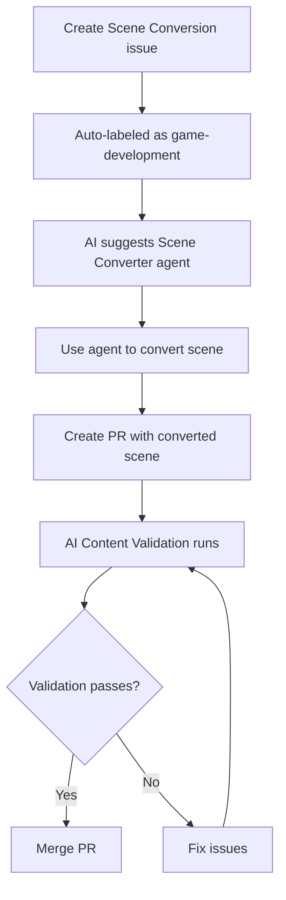
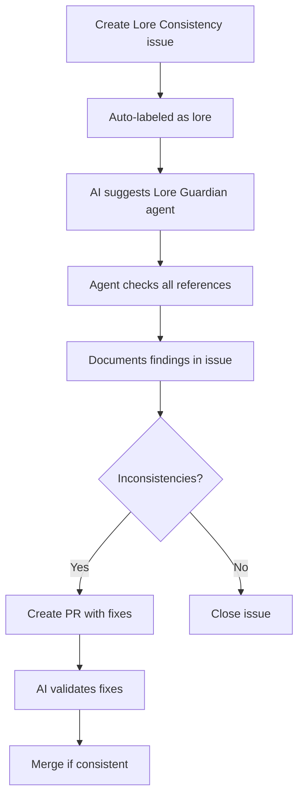
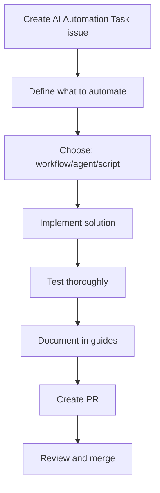

# Getting Started with AI Automation

This guide will help you start using the AI automation features in the Avalon repository.

## For Project Contributors

### Step 1: Understand What AI Can Do

The repository now has three specialized AI agents:
1. **Lore Steward** - Helps with file organization and general coding
2. **Scene Converter** - Converts HTML game scenes to ChoiceScript
3. **Lore Guardian** - Validates narrative consistency

### Step 2: Create Your First AI-Assisted Task

#### To Convert a Scene:
1. Go to **Issues** → **New Issue**
2. Select **Scene Conversion** template
3. Fill in:
   - Scene name (e.g., `singing_dunes`)
   - Source location hint
   - Expected outcome
4. Submit the issue
5. The system will:
   - Auto-apply labels (`game-development`, `ai-task`)
   - Suggest using Scene Converter agent
   - Provide relevant file references

#### To Validate Lore:
1. Go to **Issues** → **New Issue**
2. Select **Lore Consistency Check** template
3. Fill in:
   - Element type (character, location, etc.)
   - Element name
   - Affected files
4. Submit the issue
5. The system will:
   - Auto-apply labels (`lore`, `ai-task`)
   - Suggest using Lore Guardian agent
   - Provide validation checklist

### Step 3: Use AI Commands

In any issue comment, you can type:
```
/create-checklist
```

This will automatically generate a detailed task breakdown with planning, implementation, validation, and finalization steps.

### Step 4: Work with AI Agents

When the issue suggests an AI agent, you can invoke it:
```
@copilot /agent scene-converter Convert the singing_dunes arrival scene from game.js to ChoiceScript
```

Or for lore validation:
```
@copilot /agent lore-guardian Check if Izack's age is consistent across all files
```

### Step 5: Create a Pull Request

When you create a PR with changes to:
- `choicescript_game/scenes/` files
- `lore/` files
- `writing_drafts/` files

The **AI Content Validation** workflow automatically runs and checks:
- ✅ ChoiceScript syntax
- ✅ Broken gotos
- ✅ Stat modifications
- ✅ Polly commentary presence
- ✅ Character name consistency
- ✅ Scene parity with HTML version

Review the workflow output and address any warnings before merging.

## For Developers Adding Automations

### Creating a New Workflow

1. Create issue using **AI Automation Task** template
2. Specify:
   - What to automate
   - Current manual process
   - Expected benefits
   - Implementation approach
3. Create workflow file in `.github/workflows/`
4. Test with `workflow_dispatch` trigger
5. Document in `AI_AUTOMATION_FEATURES.md`

### Creating a New Agent

1. Create file in `.github/agents/[agent-name].agent.md`
2. Follow the format:
   ```markdown
   ---
   name: Agent Name
   description: Brief description
   ---
   
   # Agent Name
   
   [Detailed instructions for the agent]
   ```
3. Document capabilities in `AI_AUTOMATION_FEATURES.md`
4. Test by invoking with `@copilot /agent [agent-name]`

### Adding Auto-Labels

Edit `.github/workflows/ai-task-automation.yml`:
```javascript
if (title.includes('your-keyword') || body.includes('your-keyword')) {
  labels.push('your-label');
}
```

### Adding AI Suggestions

Edit `.github/workflows/ai-task-automation.yml`:
```javascript
if (label.name === 'your-label') {
  comment = `Your AI assistance message here...`;
}
```

## Common Workflows

### Converting a Scene from HTML to ChoiceScript



### Validating Lore Consistency



### Adding New Automation



## Tips for Success

### For Scene Conversion
- ✅ Always reference `first_lesson.txt` for formatting
- ✅ Test all gotos resolve correctly
- ✅ Include Polly commentary
- ✅ Add sensory details and expand content
- ✅ Verify stat modifications are appropriate

### For Lore Validation
- ✅ Cross-reference master chronicle
- ✅ Check character ages against timeline
- ✅ Verify magic system terminology
- ✅ Document findings clearly
- ✅ Suggest specific fixes

### For Adding Automations
- ✅ Start small and iterate
- ✅ Test with `workflow_dispatch` first
- ✅ Handle errors gracefully
- ✅ Document thoroughly
- ✅ Update user guides

## Troubleshooting

### Issue Not Auto-Labeled
**Problem:** Created issue but no labels appeared
**Solution:** 
- Check if issue title/body includes trigger keywords
- Verify workflow has `issues: write` permission
- Check workflow run logs in Actions tab

### Workflow Not Running
**Problem:** PR created but validation didn't run
**Solution:**
- Check if files match workflow's `paths` trigger
- Verify you're on the correct branch
- Check workflow is enabled in Actions settings

### Agent Not Responding
**Problem:** Invoked agent but no response
**Solution:**
- Check agent name is correct
- Ensure agent configuration file exists
- Try providing more context in your request
- Check if agent is supported in your environment

### Validation Failing
**Problem:** Content validation workflow fails
**Solution:**
- Review specific job output in Actions
- Check file syntax (indentation, commands)
- Verify all gotos have matching labels
- Look for typos in stat names

## Examples

### Example 1: Converting Singing Dunes Scene

**Issue Title:** Convert Singing Dunes Arrival Scene

**Using Template:** Scene Conversion

**Agent Invocation:**
```
@copilot /agent scene-converter 

Convert the singing_dunes arrival scene from game/game.js to ChoiceScript.

Context:
- Scene introduces the truth-testing desert
- Features Kael as the desert guide
- Should include Polly's sarcastic commentary about truth
- Stats: collaboration increases if player is honest

Please expand on the original with vivid sensory details.
```

**Expected Result:**
- Converted scene in `choicescript_game/scenes/singing_dunes.txt`
- Proper ChoiceScript syntax
- All gotos resolve
- Polly commentary included
- Validation passes

### Example 2: Checking Character Consistency

**Issue Title:** Validate Izack Thorne Consistency

**Using Template:** Lore Consistency Check

**Agent Invocation:**
```
@copilot /agent lore-guardian

Check if Izack Thorne's character details are consistent across all files.

Specifically verify:
- Age calculations (should be 23 in Book 1)
- Relationship to Polly
- Magic specialization (collaborative casting)
- Role as Avalon Academy founder

Files to check:
- lore/IZACK_MASTER_CHRONICLE_UPDATED.txt
- game/game.js
- choicescript_game/scenes/*.txt
- writing_drafts/ chapters
```

**Expected Result:**
- Comprehensive consistency report
- List of any inconsistencies found
- Specific file locations and line numbers
- Recommendations for fixes

## Next Steps

1. **Try it out:** Create a test issue using one of the templates
2. **Invoke an agent:** Use `@copilot /agent` to get AI assistance
3. **Make a PR:** See the automated validation in action
4. **Add automation:** Propose a new feature using AI Automation Task template

## Resources

- **Full Documentation:** `docs/AI_AUTOMATION_FEATURES.md`
- **Quick Reference:** `docs/AI_QUICK_REFERENCE.md`
- **Project Guide:** `.github/COPILOT_INSTRUCTIONS.md`
- **Roadmap:** `docs/PROJECT_ROADMAP.md`

---

**Questions?** Create an issue with the label `ai-automation` and we'll help!

**Want to contribute?** Check `docs/CONTRIBUTING.md` for guidelines.

---

*Welcome to the future of collaborative development with AI!* 🤖✨
